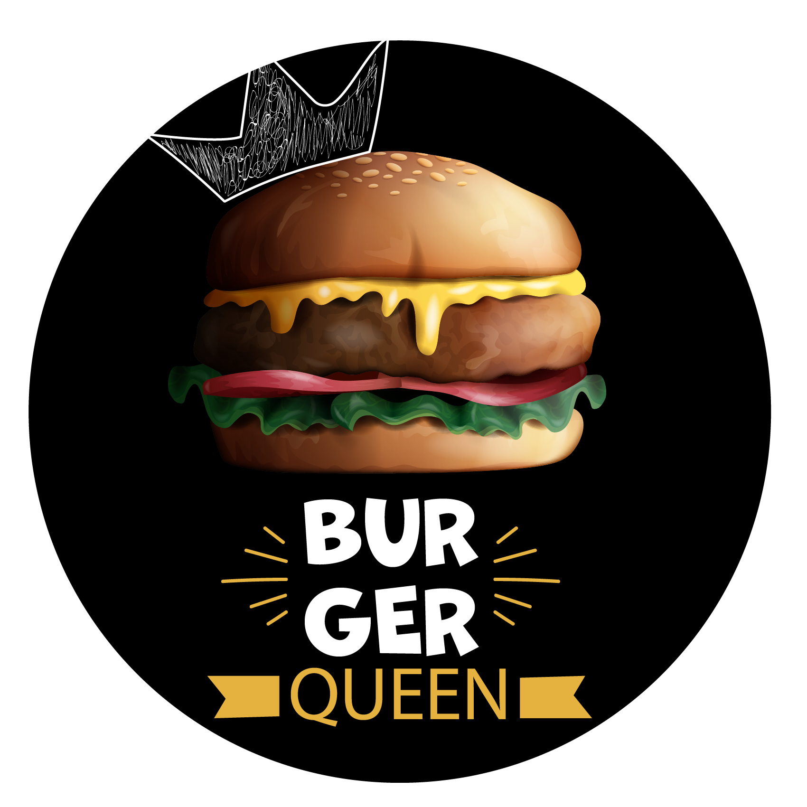

## BURGER QUEEN | La memoria de tu restaurante

    

## Índice

* [1. Preámbulo](#1-preámbulo)
* [2. Resumen del proyecto](#2-resumen-del-proyecto)
* [3. Prototipado](#3-prototipado)
* [4. Historias de usuario](#4-historias-de-usuario)
* [5. Acceso a Burger Queen](#5-acceso-a-burger-queen)
* [6. Autoras](#6-autoras)

## 1. Preámbulo

Estamos en la era de la tecnología, su uso es indispensable incluso para la administración de negocios y en este caso de un restaurante.

Burger Queen es una aplicación que colabora en la administración de los diferentes roles que se pueden encontrar en la gestión de un restaurante: Administrador, chef, mesero, la administración de productos, de ordenes entre otros, lo que hace que la gestión y el servicio sea más optimo, se identifique la excelencia en el servicio  y eleve el status del restaurante. 

## 2. Resumen del proyecto

En este proyecto se construyó una App que gestiona usuarios, productos y ordenes en un restaurante, a continuación damos un vistazo a Burger Queen.

    

    

    

    

    

    

## 3. Prototipado

Para el desarrollo de Burger Queen se realizó un prototipado de baja y alta fidelidad, de igual manera estos prototipos tuvieron su respectivo test de usabilidad.

### Prototipos de baja fidelidad

    

### Prototipos de alta fidelidad

    

## 4. Historias de usuario

Para el paso a paso del desarrollo de Burger Queen se definieron las siguientes historias de usuario:

* _**Historia de usuario No.1**_: Yo Como meser@,
Quiero poder ingresar al sistema de pedidos.

* _**Historia de usuario No.2**_: Yo como administrador/@,
Quiero destinar los productos 
Para mantener actualizado el menú

* _**Historia de usuario No.3**_: Yo como administrador/@,
Quiero gestionar a los usuarios de la plataforma 
Para mantener actualizado la información de mis trabajadorxs.

* _**Historia de usuario No.4**_: Yo como meser@,
Quiero tomar el pedido de unx clientx para no depender de mi mala memoria, 
Para saber cuánto cobrar, y enviarlo a la cocina para evitar errores y que se puedan ir preparando en orden.

* _**Historia de usuario No.5**_: Yo Como meser@
Quiero ver los pedidos que están preparados 
Para entregarlos rápidamente a lxs clientxs que las hicieron.

* _**Historia de usuario No.6**_: Yo como jefe/a de cocina,
Quiero ver los pedidos de lxs clientxs en orden y marcar cuáles están listos 
Para saber qué se debe cocinar y avisar a lxs meserxs que un pedido está listo para servirlo a un clientx.

## 5. Acceso a Burger Queen

|Email| Password | Rol             |     Super women porque...              |
|--------|----------------------------|:--------------------:|------------------|
|anita.borg@systers.xyz|123456|Administradora|Fue una científica informática de Estados Unidos que dedicó gran parte de su carrera profesional a impulsar la presencia de mujeres en el sector tecnológico.                    |
|grace.hopper@systers.xyz|123456|Administradora|Fue la creadora del primer compilador de ordenadores en 1952.|
|mariana.costa@systers.xyz|123456|Chef|Es una científica y empresaria peruana conocida por ser la creadora de Laboratoria, organización de impacto social que trabaja para lograr una economía digital más diversa, inclusiva y competitiva, que abra oportunidades para que cada mujer pueda desarrollar su potencial.|
|diana.trujillo@systers.xyz|123456|Mesera| Ingeniera aeroespacial Colombiana, hizo parte del equipo que logró la llegada del Rover Perseverance a Marte y actualmente es directora de vuelo en la Nasa.|

## 6. Autoras

*  Adriana Maria Ruiz Henao
*  Ibeht Milady Carreño Avella
